# 輔仁大學理工轉學考作品：跨平台科技趨勢與資安保護網路爬蟲

## 📝 作品簡介
本專案為一套自動化網路爬蟲系統，旨在針對主流網路社群與新聞媒體進行焦點監測。系統會自動針對「詐騙、個資、釣魚」等資安關鍵字進行跨平台搜集，並自動去重、清理資料，最終匯出為 Excel 報表以利數據分析。

---

## 🛠 執行環境需求
本專案於 Python 環境下開發，執行前請確保透過終端機安裝相關套件： 
```
pip install requests
pip install beautifulsoup4
pip install pandas
pip install openpyxl
```
---
本系統共包含三個核心爬蟲模組：
1. **PTT 社群爬蟲**：抓取 PTT 看板文章之標題、人氣與發文日期。
2. **Yahoo 新聞爬蟲**：監測科技時事與資安新聞趨勢。
3. **自由時報爬蟲**：追蹤即時時事與重大資安事件報導。

---

## 📊 執行成果展示

### 1. PTT 爬蟲執行結果
> 💡 教授您好，這是 PTT 資安保護程式實際執行的畫面：
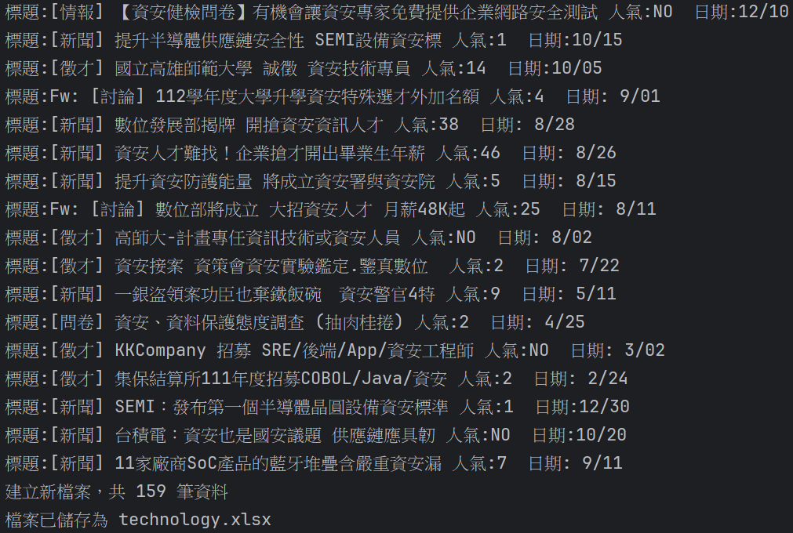

### 2. Yahoo 新聞爬蟲執行結果
> 💡 教授您好，這是 Yahoo 新聞爬蟲實際執行的畫面：
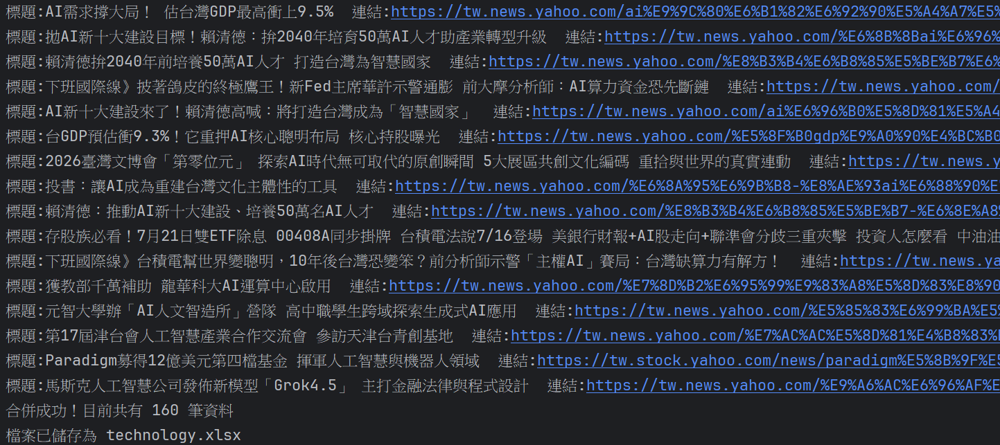

### 3. 自由時報爬蟲執行結果
> 💡 教授您好，這是自由時報爬蟲實際執行的畫面：
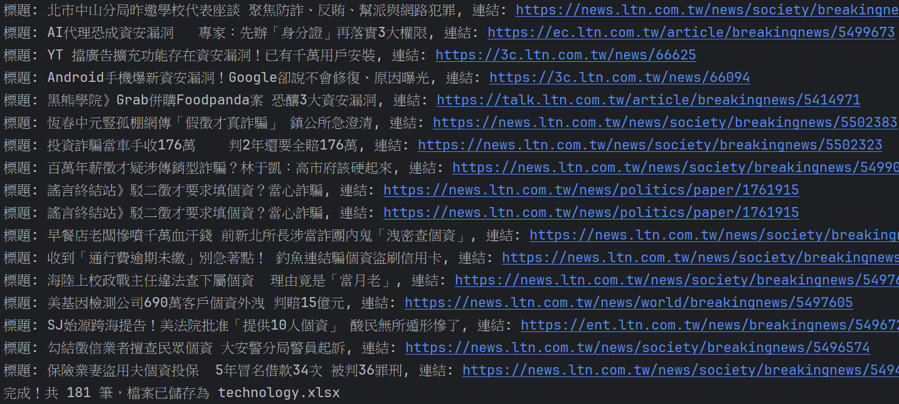


## 💻 核心原始碼 (Source Code)
> 💡 教授您好，以下為本專案之核心爬蟲模組的完整程式碼：

1. PTT 社群爬蟲程式碼

 ℹ️ 初始化與參數設定
   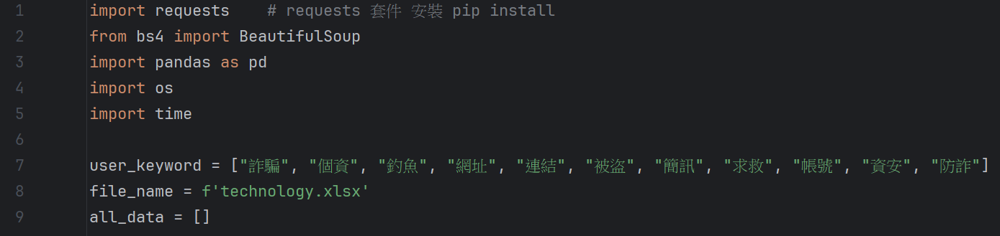
   
 ℹ️ 核心爬取與解析邏輯
   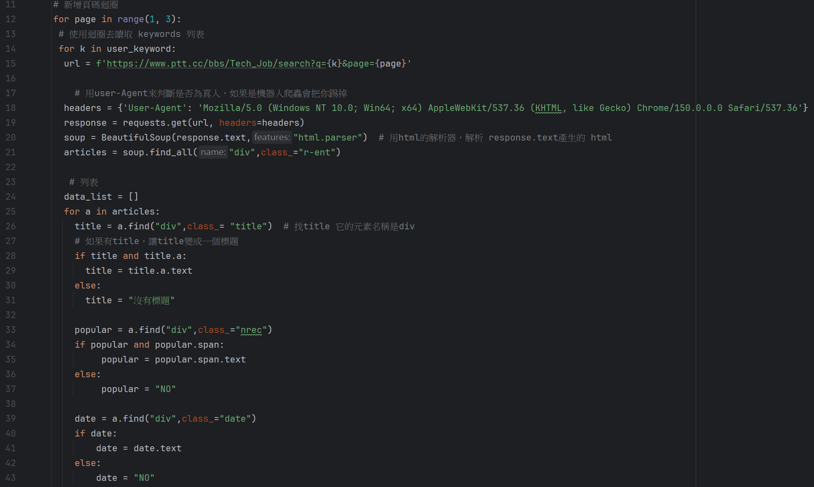
   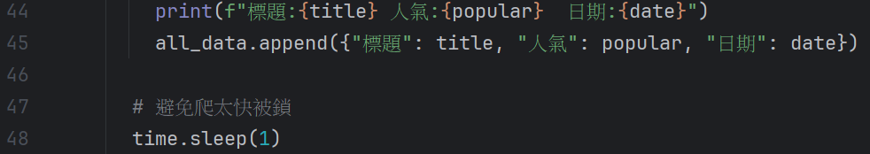

 ℹ️ 核心爬取與解析邏輯 
   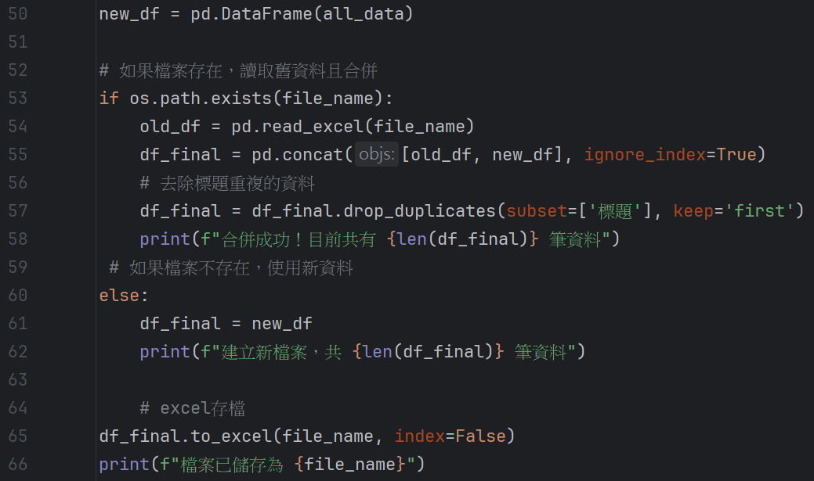


2.Yahoo 新聞爬蟲執行結果  
 
  ℹ️ 初始化與參數設定
   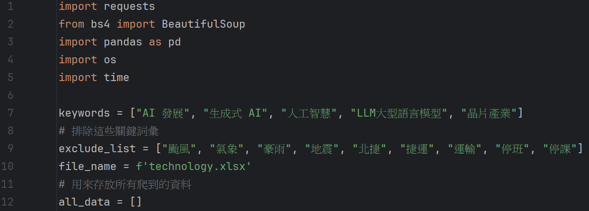

  ℹ️ 核心爬取與解析邏輯
   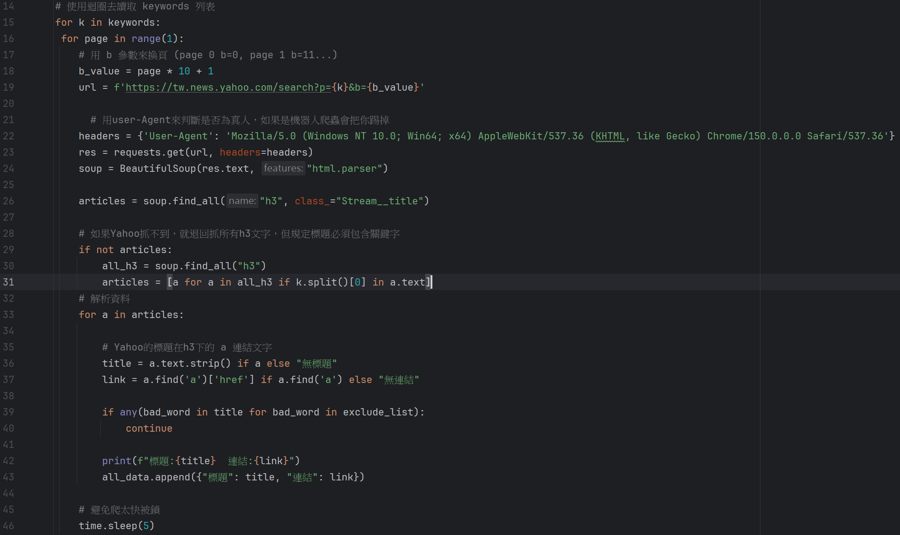 

   ℹ️ 核心爬取與解析邏輯 
   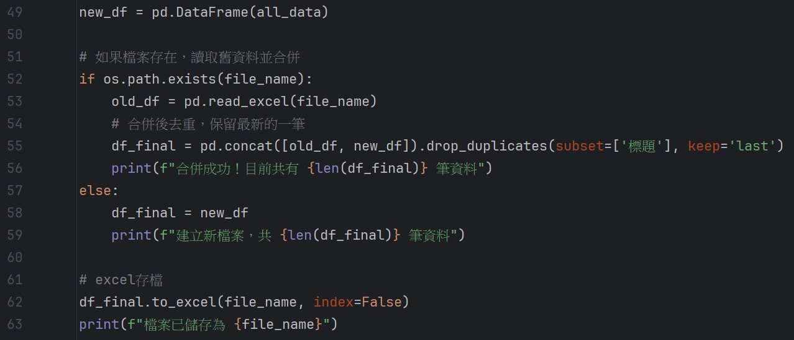


 3. 自由時報爬蟲執行結果
    
  ℹ️ 初始化與參數設定
   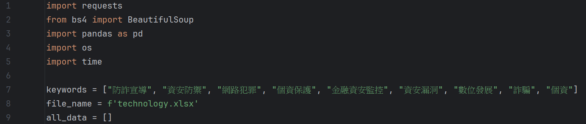

  ℹ️ 核心爬取與解析邏輯
   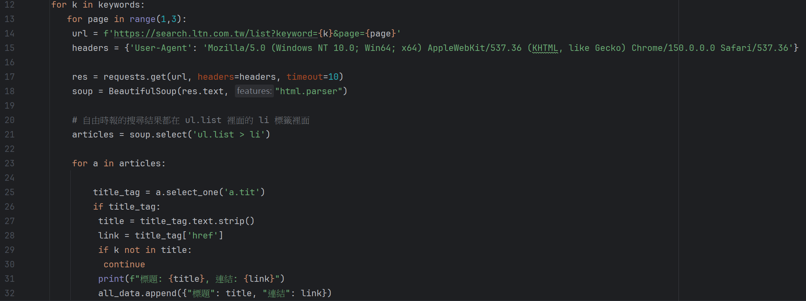 

   ℹ️ 核心爬取與解析邏輯 
   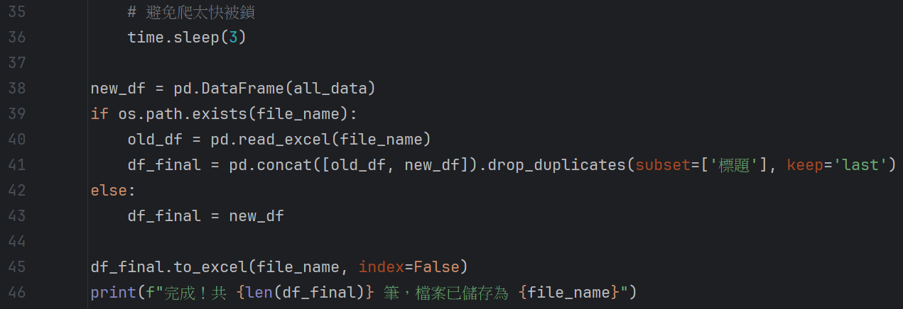
   
# 📝 設計心得:

透過這次開發，我深入理解了網路爬蟲在資料擷取與自動化處理的運作機制，並成功將其應用於跨平台資訊監測。這項專案不僅提升了我對網頁結構解析與 pandas 資料處理的實作能力，更讓我體會到將海量數據轉化為結構化資訊在輔助資安分析上的專業價值。
